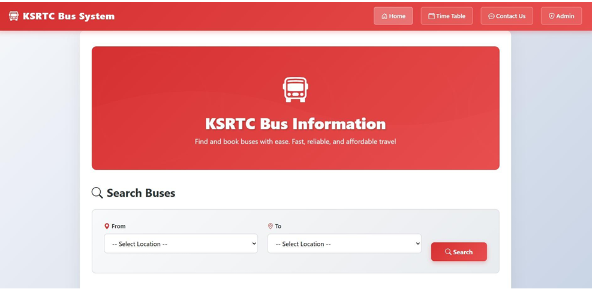
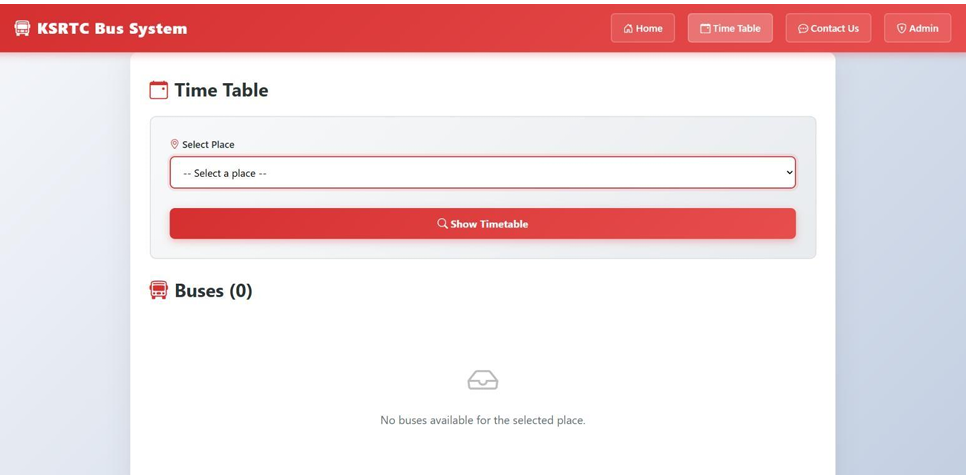
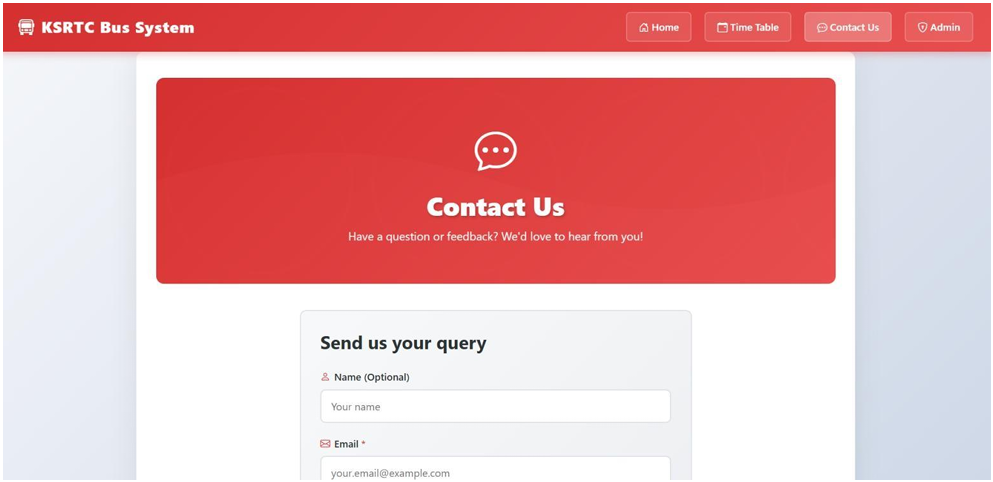
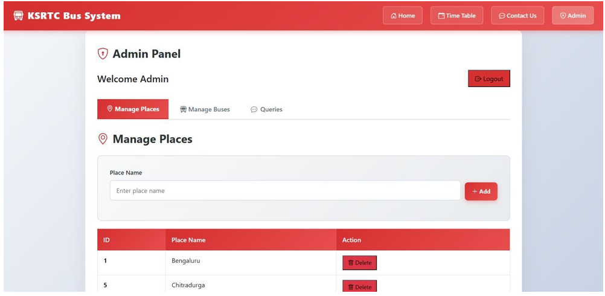

# 🚌 KSRTC Bus Information System

A full-stack MERN web application designed to provide users with easy access to KSRTC bus routes, schedules, and transportation information. The system enables passengers to search bus details while providing administrators with a secure dashboard to manage buses, places, and user queries.

---

## 📖 Project Overview

The KSRTC Bus Information System digitizes bus information management and improves accessibility for passengers. Users can search routes and view timetables without authentication, while administrators can securely manage system data through an admin panel.

The application follows a three-tier architecture using:

- React.js (Frontend)
- Node.js & Express.js (Backend)
- MongoDB & Mongoose (Database)

---

## ✨ Features

### 👤 User Features

- View bus routes and schedules
- Search buses by source and destination
- View timetable information
- Submit queries through the Contact Us page
- Easy-to-use responsive interface

### 🔐 Admin Features

- Secure admin login
- Add and manage places
- Add and manage bus details
- View user queries
- Perform CRUD operations on transportation data

---

## 🛠️ Tech Stack

| Layer | Technology |
|---------|------------|
| Frontend | React.js, HTML5, CSS3, JavaScript, Vite |
| Backend | Node.js, Express.js |
| Database | MongoDB, Mongoose ODM |
| Version Control | Git, GitHub |

---

## 🏗️ System Architecture

The application follows a Three-Tier Architecture:

### 1. Presentation Layer (Frontend)

- User Interface
- Admin Dashboard
- REST API Integration

### 2. Application Layer (Backend)

- Authentication
- Business Logic
- REST APIs

### 3. Data Layer (Database)

- MongoDB Collections
- Data Storage and Retrieval

---

## 📂 Database Collections

### Admin

```json
{
  "username": "string",
  "password": "string"
}
```

### Place

```json
{
  "place_name": "string"
}
```

### Bus

```json
{
  "route": "string",
  "timing": "string",
  "source": "string",
  "destination": "string"
}
```

### Query

```json
{
  "name": "string",
  "email": "string",
  "message": "string"
}
```

---

## 🔌 API Endpoints

### Authentication

| Method | Endpoint | Description |
|----------|----------|----------|
| POST | `/api/admin/login` | Admin Login |

### Places

| Method | Endpoint | Description |
|----------|----------|----------|
| GET | `/api/place` | Get All Places |
| POST | `/api/place/add` | Add Place |

### Buses

| Method | Endpoint | Description |
|----------|----------|----------|
| GET | `/api/bus` | Get All Buses |
| POST | `/api/bus/add` | Add Bus |

---

## ⚙️ Installation

### Clone Repository

```bash
git clone https://github.com/PrathapCodes/ksrtc-bus-information-system.git
cd ksrtc-bus-information-system
```

### Backend Setup

```bash
cd backend
npm install
```

Create a `.env` file:

```env
MONGODB_URI=your_mongodb_connection_string
PORT=4000
```

Run the backend server:

```bash
npm run dev
```

### Frontend Setup

```bash
cd frontend
npm install
npm run dev
```

---

## 📸 Screenshots

### Home Page



### Timetable Page



### Contact Page



### Admin Dashboard



---

## 🚀 Future Enhancements

- Online Ticket Booking
- Real-Time Bus Tracking
- Seat Availability Information
- User Authentication for Passengers
- Mobile Application Support
- Live Bus Status Updates

---

## 🎯 Project Outcomes

- Developed a full-stack MERN application
- Implemented RESTful APIs using Express.js
- Integrated MongoDB using Mongoose
- Developed secure admin authentication
- Implemented CRUD operations for buses and places
- Built responsive frontend interfaces
- Improved accessibility of transportation information

---

## 👨‍💻 Author

**Prathapa V**

- Ramaiah Institute of Technology
- Computer Science & Engineering

GitHub: https://github.com/PrathapCodes

---

## 📜 License

This project is licensed under the MIT License.
